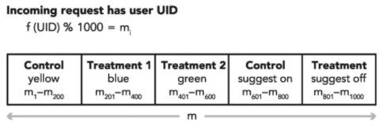
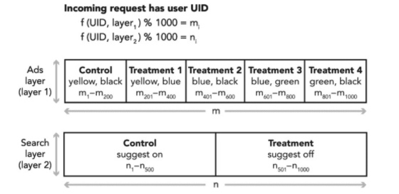

* 综述：设计->实施->分析
    - 设计：
        - 目的：
        - 单元：
        - 流程：
        - 指标：
        - 样本量：
        - 时间：
        - 分组：
    - 实施：
        - 分流：
    - 分析：
        - 环境检验
        - 假设检验
        - 分析报告

总分结构：先用一篇介绍 AB 实验的整体，再用N篇文章分述各环节的核心点

1. 综述：设计->实施->分析
    1. 什么是
    2. 有什么用
    3. 怎么用：实验前->实验中->实验后
2. 实验前：实验设计
    1. 实验目的
    2. 实验指标
    3. 实验类型
    4. 实验参数
3. 实验中：实验实施
    1. 实验分流：层（单层、多层）、域
4. 实验后：实验分析
    1. 效果评估
    2. 假设检验
    3. 实验结论

1. Introductory Topics for Everyone：
    1. Introduction and Motivation：简介和动机
    2. Running and Analyzing Experiments：实验流程 demo
    3. Twyman’s Law and Experimentation Trustworthiness：实验可信度评估（健全检验、假设检验）
    4. Experimentation Platform and Culture： 实验流程管理（设计、部署、分析）

2. Selected Topics for Everyone：第二部分详细介绍了五个与实验相关的主题，特别是领导者和高管
3. Complementary and Alternative Techniques to Controlled Experiments：控制实验的补充和替代技术
4. Advanced Topics for Building an Experimentation Platform：构建实验平台的高级主题

本书目的：

1. 用科学的方法用控制实验来评估假设
2. 定义关键指标和理想的总体评估标准
3. 测试结果的可信度，并提醒实验者违反假设
4. 根据结果快速迭代和解释
5. 实施护栏保护关键业务目标
6. 建立一个可扩展的平台，将实验的边际成本降低到接近零
7. 避免诸如结转效应、泰曼定律、辛普森悖论和网络互动等陷阱
8. 了解统计问题在实践中的表现，包括常见的违反假设的情况”

精益方法论的核心是科学方法：创建假设、运行实验、收集数据、提取洞察力以及验证或修改假设。A/B测试是创建可验证和可重复实验的黄金标准，本书是其权威文本。

分流：随机、均匀
解释：只能说明相关性，不能说明因果性

成功实验的必要因素：

1. 实验单位：独立地分配到不同分组中，而不会相互影响
2. 数据量
3. 核心指标

过程：

1. 指定策略：control treatment
2. 确定 OEC：Overall Evaluation Criterion
3. 划分人群：
4. 分析：假设检验

过程：

1. 实验设计
    1. 确定假设：实验目的
    2. 实验对象：具有某些属性/行为的用户...
    3. 分组策略：实验组、对照组、AA
    4. 设计OEC：Overall Evaluation Criterion
        1. 成功指标
        2. 护栏指标：保证底层的实验设计、基础设施或数据处理正确
        3. 质量指标
        4. 产品指标
        
    5. 实验时间：
        1. 更长的时间会带来更多的用户
        2. 周内效应：用户在周末的表现可能和周内的表现不同，建议至少进行一周的实验
        3. 季节效应：节假日用户的行为会有所不同
        4. 新颖效应：有些实验往往具有较大或较小的初始效应，需要时间来稳定。例如，用户可能会尝试一个新的炫目按钮，发现它没有用处，所以点击按钮的次数会减少
    6. 实验规模：直接影响实验的精度，实验规模越大精度越好，越能够检测到微小的差异；假设检验要求有多少（样本量是可以计算出来的）、实际能获取多少、风险和成本
        1. 实验是否安全：有风险应先从小规模实验开始
        2. 实验是否需要和其他实验共享流量
2. 实验实施：如何分流
    1. 实验正交：实验平台负责对流量进行划分
    2. 数据收集：
3. 实验分析：分析->决策（成本-效果衡量）
    1. 环境检验（健全性检查）：检验实验是否按照预期进行，在实验组合对照组之间检查不变量，如果存在差异，可能导致结果的无效
        1. Trust-related guardrail metrics 例如期望控制和处理样本根据配置调整大小，或者它们具有相同的缓存命中率。
        2. Organizational guardrail metrics
        3. SRM 采样率不匹配
    2. 假设检验：只能检验你的假设是否可被接受，至于两个实验组多大的差异能够带来商业价值（实践显著性水平），这并不是假设检验本身要回答的；需要结合业务实际情况来确定

## 实验平台
如何构建一个实验平台，一个实验平台必须包含整个过程的每一步，从设计和部署实验到分析它们，一个实验平台应包含四个高级组件：

1. 实验定义：通过用户界面（UI）或应用程序编程接口（API）定义、设置和管理实验，并存储在实验系统配置中
2. 实验部署：包括服务器端和客户端，包括变量分配和参数化
3. 实验分析：包括指标的定义和计算以及p值等统计测试

实验平台架构：

### 实验定义
要运行许多实验，实验者需要一种方法来轻松定义、设置和管理实验生命周期。要定义或指定一个实验，我们需要一个所有者、一个名称、一个描述、开始和结束日期以及几个其他字段（见第12章）。平台还需要允许实验进行多次迭代，原因如下：

1. 根据实验结果改进该功能，这可能还涉及修复实验中发现的错误。
2. 逐步向更广泛的受众推广实验

该平台需要一些接口和/或工具来方便地管理许多实验及其多次迭代，功能应包括：

1. 编写、编辑和保存实验规范草案。
2. 比较实验的草稿迭代与当前（正在运行的）迭代。
3. 查看实验的历史或时间轴（即使它不再运行）。
4. 自动分配生成的实验ID、变量和迭代，并将它们添加到实验规范中。这些id在实验仪器中是必需的（本章后面讨论）。
5. 验证规范中是否没有明显的错误，例如配置冲突、目标受众无效等。
6. 检查实验的状态以及开始/停止实验。为了防止人为错误，通常只有实验所有者或有特殊许可的个人才能开始实验。然而，由于伤害用户的不对称性，任何人都可以停止实验，尽管会生成警报以确保通知实验所有者

而且，由于实验正在影响真正的用户，因此需要额外的工具或工作流程在实验变体上线之前对其进行检查。选项包括在部署之前必须运行的测试代码，或者是一个权限控制系统，在这个系统中，实验必须得到可信专家的批准。

### 实验部署

部署包含两种组件：（流量划分、代码管理）

1. 实验基础设施：提供实验定义、变量设置（就是分组染色）以及其他信息
2. 生产代码更改，根据实验分配实现不同的行为

实验设施必须提供：

1. Variant assignment ：假设用户是随机化单元，给定一个用户请求及其”属性（例如，国家、语言、操作系统、平台），该请求分配给哪个实验和变体组合？这个赋值基于实验规范和一个ID的伪随机散列，即f（ID）。在大多数情况下，为了确保用户的分配是一致的，使用用户ID。变量赋值也必须是独立的，因为知道一个用户的变量赋值不应该告诉我们关于另一个用户的变量赋值的任何信息
2. 生产代码、系统参数和值：既然您有了变量分配和定义，那么如何确保用户获得适当的体验：您如何管理不同的生产代码，哪些系统参数应该更改为什么值？

流量划分可以发生在流程的几个地方：生产代码之外、客户端、服务器，为了更好地做出决定，需要考虑以下因素：

1. 在流程的哪一点上，您有完成变量分配所需的所有信息？例如，如果您只有一个用户请求，那么您可能拥有诸如用户ID、语言和设备等信息。要使用其他信息，例如帐户的年龄、上次访问的时间或访问频率，您可能需要先进行查找，然后才能使用该标准进行变量分配。这可能会将变量赋值推送到流的后面
2. 你允许实验任务只在流程中的一个点发生还是在多个点发生？如果您正处于构建实验平台的早期阶段（步行或早期跑步阶段），我们建议只在其中一个点进行实验分配，以保持简单。如果您有多个分配点，您将需要正交性保证（例如，重叠实验，如本章后面的“并发实验”中所述），以确保较早发生的实验分配不会偏向流中稍后发生的实验分配。

流量划分可以发生在数据流的不同环节，同一组流量在不同环节构成不同“层”，层之间的流量应保证正交（流量穿越每层实验时，都会再次随机打散），层内流量划分保证互斥（同一层内不同组的流量互不重叠）：

分层是为了充分利用有限的用户资源，实施尽可能多的实验：

1. 单层实验：流量划分是用户被一致分配到实验变体的过程。在Walk阶段，实验的数量通常很小，通常将所有的流量划分为每个实验变量接收总流量的特定部分。您可能有一个实验，其中一个控制和两个治疗变体占据了60%的流量，而另一个实验中只有一个控制和一个治疗占据了另外40%的流量（图4.3）。这种分配通常是使用散列函数来一致地将用户分配给bucket。在本例中，我们使用1000个不相交的bucket并指定哪个variant获取哪个bucket。在本例中，具有200个存储桶的变体具有20%的流量分配；用户对存储桶的分配必须是随机的，但必须是确定性的。如果您比较运行相同处理的任何两个桶，则假设它们在统计上相似；每个bucket中的用户数量应该大致相同（见第3章）。如果按关键维度（如国家/地区、平台或语言）对其进行细分，则跨桶比较切片也大致相同。在你的目标范围内（大致相同的质量指标），应该有相同的质量标准。监控任务是关键！Google、Microsoft和其他许多公司通过监控bucket特性发现了随机代码中的错误。另一个常见的问题是**遗留效应**，以前的实验可能会污染当前实验的桶。在每次实验中重新随机化或洗牌，使桶不再相邻是一种常见的解决方案（Kohavi等人，2012年）。单层（也称为numberline）方法很简单，允许多个实验同时运行（每个用户只在一个实验中）。在早期成熟阶段，当很少的实验同时运行时，这是一个合理的选择；然而，主要的缺点是对并发实验数量的限制，因为您必须确保每个实验都有足够的流量来提供足够的功率。在操作上，在一个单层系统中管理实验流量是很有挑战性的，因为即使在这个早期阶段，实验是并行运行的，只是不是在单个用户上。为了管理并发性，LinkedIn、Bing和Google都是从手动方式开始的（在LinkedIn，团队会通过电子邮件协商流量“范围”；在Bing，则由程序经理管理，其办公室通常挤满了乞求实验流量的人；而在谷歌，它从电子邮件和即时消息协商开始，然后转到项目经理那里）。但是，手动方法无法扩展，因此随着时间的推移，这三家公司都转向了程序化分配。

1. 并行实验：要将实验规模扩大到单层方法所能达到的范围，您需要转移到某种并发（也称为重叠）实验系统中，在这种系统中，每个用户可以同时进行多个实验。实现这一点的一种方法是有多个实验层，每个层的行为类似于单层方法。为了保证跨层实验的正交性，在给bucket分配用户时，添加层ID。在这里您还可以添加层ID（或其他指定约束的方式），如上面讨论的实验规范中所述。当一个请求进来时，每个层的变量分配都会完成一次（参见图4.4中的两层示例）。这意味着生产代码和指令插入都必须处理变量id的向量。并行实验系统的主要问题是如何确定层，有几种选择：
    1. 一种可能性是将全因子实验设计扩展到全因子平台设计。在全因子实验设计中，每个可能的因子组合都作为一个变量进行测试。如果我们将其扩展到一个平台，那么用户同时参与所有实验：在每次实验运行中，用户都被分配到一个变量（控制或任何治疗）。每个实验都与一个唯一的层ID相关联，因此所有实验都是相互正交的。同一个实验的迭代通常共享相同的哈希ID，以确保用户获得一致的体验。这种简单的并行实验结构允许您以分散的方式轻松缩放实验数量；这种平台设计的主要缺点是无法避免潜在的碰撞，如果两个不同的实验中的某些处理方法共存，用户的体验就会很差。例如，我们可以在实验一测试蓝色文本，在实验二测试蓝色背景。对于任何碰巧同时使用这两种疗法的用户来说，这将是一种可怕的体验。从统计学的角度来看，这两个实验是相互作用的。这不仅是一个糟糕的用户体验，在不考虑两个实验之间的任何交互作用的情况下，每个实验单独测量的结果也可能是不正确的。注意，并非所有的相互作用都是拮抗的，有时在两种疗法中都有帮助，而不是相加。也就是说，如果拆分流量时统计能力的减少超过了交互的潜在关注，那么因子化平台设计可能是首选。此外，如果我们独立设置这些实验，我们可以分析哪些实验相互作用，如果没有相互作用，它们的效果会怎样。当然，如果没有显著的交互作用，每个实验都可以单独分析，并且每个实验都可以享受到最大功率的全部可用流量。微软的实验平台有一个强大的系统，可以自动检测交互作用（Kohavi等人。2013年）。为了防止糟糕的用户体验，我们可以使用嵌套平台设计（Tang et al。或基于约束的平台设计（Kohavi等人。2013年）。对于可扩展性，谷歌、LinkedIn、微软和Facebook使用了这些设计的一些变体（Xu 2015、Bakshy、Eckles和Bernstein 2014）。在嵌套式设计中，系统参数被划分为多个层，因此，组合起来可能产生不良用户体验的实验必须在同一层，并通过设计防止为同一用户运行。例如，可能有一层用于公共UI元素（例如，页面的页眉和页眉中的所有信息），另一层用于正文，第三层用于后端系统，第四层用于排名参数，等等。基于约束的设计让实验者指定约束，系统使用图着色算法来确保没有两个共享关注点的实验暴露给用户。检测交互作用的自动化系统（Kohavi等人。2013年）可能是一个有用的扩展。”

### 实验分析
为了进入实验成熟的后期阶段，我们还需要自动化分析，这对于节省团队进行耗时的即席分析，以及确保报告背后的方法是可靠的、一致的和有科学依据的，都是至关重要的。我们假设选择目标、防护栏和质量指标的工作已经完成，并且已经将权衡编入OEC。

自动化分析首先需要数据处理，其目标是使数据进入可用状态，以计算和可视化实验结果。由于有关用户请求的检测可能发生在多个系统中，因此数据处理通常涉及对不同日志进行排序和连接，以及清理、会话和丰富日志。这个过程有时被称为烹调数据（cooking the data）。

## 参考
    
功效函数：http://powerandsamplesize.com/Calculators/Article-1
    
- TRUSTWORTHY ONLINE CONTROLLED EXPERIMENTS：值得信赖的在线控制实验
