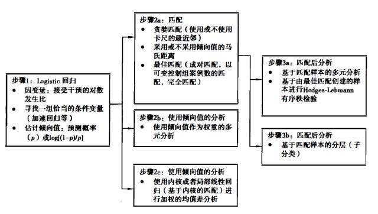
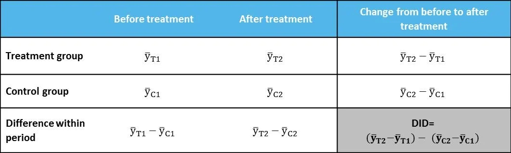
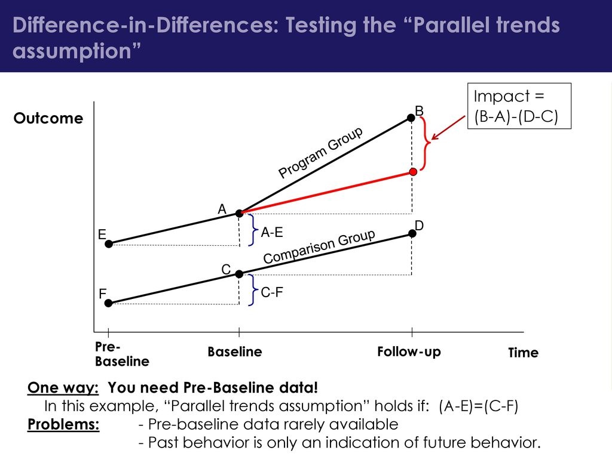

# 倾向值分析

> 举个例子

分析 -> 推断 -> 预测

推断：假设检验、因果推断、关联推断

理论和实质性知识

## 因果关系
定义

## 因果推断
定义

基于反事实框架对干预实验中的因果关系进行推断，以 PSM 为例，其一般步骤如下：

### 因果关系的反事实框架
Neyman-Rubin反事实框架在大多数情况下都是对因果效应进行统计学探索的一个有用工具

反事实
反事实框架模型：干预（W）、潜在结果（Y0i）、公式
因果推断的基本问题：
平均干预效应的标准估计量：

1. 未考虑协变量的威胁：
2. 总体平均干预效应=干预组平均效应-未干预组平均效应
3. 观察研究往往存在选择偏差

## 倾向值匹配及相关模型
倾向值：给定协变量的条件下将样本分配到干预组的概率；

三种倾向值模型：

1. 倾向值匹配
2. 倾向值分层
3. 倾向值加权：使用倾向值作为抽样权重进行多元分析

倾向值匹配的最新进展：

1. 一般化加速回归
2. 最佳匹配

### 概述

在 1983 年，Rosenbaum 和Rubin 发表了一篇在倾向值分析方面影响深远的论文这篇论文阐述了适用于各种倾向值模型的原理和应用原则。

倾向值匹配的步骤：

1. 寻找协变量，基于协变量预测样本倾向值：寻找可能会导致干预组和控制组之间选择偏差的协变量；在给定协变量的条件下预测样本被分配到干预组的条件概率（倾向值），这个值通常是logistic 回归模型得到的一个预测概率，实际研究中，Rosenbaum和Rubin（1985）建议使用预测概率的 logit 作为倾向值，因为 q(x) 比 e(x) 具有更理想的分布特征（近似于正态）；(Kindle 位置 2952-2953). Kindle 版本. ；倾向值是一个**平衡值**，它将协变量对干预分配的影响浓缩在了一个条件概率中，一对具有相似倾向值的干预组成员和控制组成员被视为可比的，即使他们也许在具体协变量的取值上会不同；
2. 基于样本倾向值进行匹配或加权：
    1. 匹配：在干预组和控制组之间匹配具有相似倾向值的样本对；由于估计的倾向值所形成的共同支持域（common support region）并不总是覆盖研究的全部成员，对于一些干预组成员，可能找不到相匹配的控制组成员，并且一些控制组成员可能并不被使用，所以匹配通常会导致研究成员的损失，正因如此，匹配也被称作再采样；基于倾向值的再采样会使干预组和控制组在协变量上变得平衡并基于观测量度（observed measures）来控制选择偏差；已发展出各种算法来匹配具有相似倾向值的成员，包括贪婪匹配、马氏距离匹配以及最佳匹配；
    2. 加权：也可以不对样本进行匹配，而是将倾向值用作权重，根据纳入样本的概率对观测案例进行调整，倾向值加权不仅克服了样本成员的丢失问题，同时还提供了两种干预效应的估计值（ATE 和 ATT）；
3. 基于匹配后的样本进行分析：匹配对干预组和控制组之间的选择偏差进行了修正，使用匹配后的新样本，可以像通常使用随机化试验得到的样本那样进行分析；
    1. 多元分析：多元分析仅对由贪婪匹配所形成的匹配样本来说才是允许的；
    2. 差分回归：对于通过最佳匹配所构建的匹配样本，需要进行特定类型的分析，包括针对最佳成对匹配对干预组和控制组成员之间结果的差分对协变量的差分进行回归，以及针对最佳完全匹配而采用的结果变量之 Hodges-Lehmann 有序秩的差分对协变量之有序秩的差分进行回归；
    3. 分层分析：也可以不进行多元建模，而是按照倾向值分层，然后比较同一层内干预组和控制组之间某一结果的平均差异，然后产生整个样本的均值和方差来测量样本的 ATE 及其统计显著性；
    
### 维度问题和倾向值性质
倾向值的优点在于它对维度的简化：倾向值将协变量所有维度简化为一个单维的值，解决了在维度过大时，精确匹配可能会导致的大面积匹配失败；

倾向值的性质：

1. 倾向值会平衡样本中干预组和控制组之间的差异：Rosenbaum（2002b:298）证明了具有相同倾向值的一名干预组成员和一名控制组成员在观察到的协变量X上具有同样的分布。这意味着，在倾向值上同质的某个层或匹配集（matchedset）内，干预组和控制组的成员也许在X的取值上有所差异（也就是说，即使两名成员具有同样的倾向值，它们仍然可能在诸如性别等协变量上不同，如果性别这一最细的值包括在X向量中），但这些差异将是随机差异（chancedifferences）而非系统差异（systematicdifferences）
2. 给定倾向值的情况下，干预分配和协变量相互独立：这一属性将倾向值和关于强可忽略干预分配（stronglyignorabletreatmentassignment）的假定联系起来。换句话说，控制了倾向值的情况下，协变量可以被认为独立于干预的分配。因而，对于具有同样倾向值的一些观测来说，协变量的分布应当在干预组和控制组之间是一样的。此外，这一性质意味着，在控制了倾向值的条件下，和随机化实验中一样，每一名成员具有分配到干预中去的相同概率。
3. 如果强可忽略干预分配假定成立并且 e（xi）是一个倾向值，那么 e（xi）处对两种干预情形的观测到反应（observedresponse）上的期望差值等于e（xi）处的 ATE：这一性质将倾向值模型和反事实框架联系起来，并且表明了可以如何解决无法观察到干预组成员在控制状态下之结果的难题。因而，对于所有具有相同倾向值的单元来说，干预组和控制组之间结果变量的均值差是该倾向值上ATE的无偏估计。也就是说，缺少公式；
4. Rosenbaum和Rubin（1983:46）导出了一些推论来论证使用倾向值的3种主要方法的合理性
    1. 成对匹配：在一个匹配对（matchedpair）中，具有相同倾向值e（x）的干预组和控制组单元在反应（response）上的期望差值等于e（x）处的ATE，且通过这种两步抽样过程得到的配对差异的均值是 ATE ）的无偏估计
    2. 倾向值子分类：即同一层内的所有单元具有相同的e（x）并且该层内至少有一个单元接受每一类干预状态——干预均值（treatmentmean）上的期望差值等于该e（x）取值处的ATE，并且这些差值的加权平均值是干预效应τ=E（Y1|W=1）E（Y0|W=0）的无偏估计
    3. 协方差调整：

协变量的选择会对倾向值分析的整体表现产生很大影响，研究者应该纳入一些具有理论相关性的重要协变量，通常依赖于实质性信息和先前关于接受干预的预测变量研究，没有明确的程序或者检验可以用来为设定最佳的倾向值模型提供指引，并且理论通常只对如何选择和构造协变量提供微弱的指引，这一困境促进了一些十分有前景的方法的发展，比如说用来寻找最佳倾向值的一般化加速回归。

由于条件变量的选择影响着倾向值上的平衡以及最终的干预效应估计值，因此，我们必须不遗余力地保证倾向值的估计值已考虑到所有实质上有关的因素并且以一种对模型设定错误不敏感的方式使用观测数据。

总而言之，倾向值的预估依赖于协变量的选择，而协变量的选择依赖于特定的领域知识，并没有明确的方法能够帮助我们发现所有实质上有关的协变量。

### 如何计算/估计倾向值
在倾向值预估中，逻辑回归是最重要的方法。

### 如何平衡

### 匹配后分析

### 倾向值加权

对随机化控制试验（randomizedcontrolledtrials，RCTs）

## 总结
* 观察研究中常见的错误；
* 使用倾向值方法逼近随机化试验的争论；是对结果的一种校正
* 其他因果建模方法；
* 今后的发展方向；

## 参考
- 《propensity score analysis: Statistical methods and applications》：倾向得分分析：统计方法与应用
- 《Some practical guidance for the implementation of propensity score matching》：被引用3000+次的 倾向分数匹配的实践指南
- 倾向得分匹配法的详细解读：https://zhuanlan.zhihu.com/p/311128820
- 辩证看待倾向性评分法：https://blog.csdn.net/fjsd155/article/details/96651411
- 《handbook on impact evaluation》: 关于政策评估的图书
- 《counterfactuals and causal inference》：反事实与因果推理
- 《design of observational studies》：观察研究设计
- 《Causal inference in statistics, social, and biomedical sciences》：统计学，社会学和生物医学中的因果推理
- 《A Crash Course in Causality: Inferring Causal Effects from Observational Data》：coursera 因果关系速成课程：从观测数据推断因果关系
- 倾向值分析:统计方法与应用

