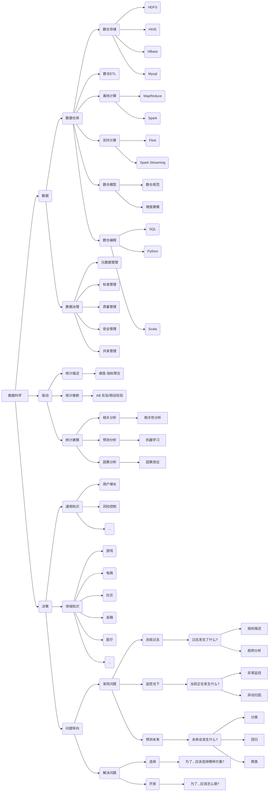

```mermaid
graph LR
数据科学-->A(数据)
A-->AA(数据仓库)
AA-->AAA(数仓存储)
AAA-->AAAA(HDFS)
AAA-->AAAB(HIVE)
AAA-->AAAC(HBase)
AAA-->AAAD(Mysql)

AA-->AAB(数仓ETL)
AA-->AABA(离线计算)
AABA-->AABAA(MapReduce)
AABA-->AABAB(Spark)
AA-->AABB(实时计算)
AABB-->AABBA(Flink)
AABB-->AABBB(Spark Streaming)

AA-->AAC(数仓模型)
AAC-->AACA(数仓规范)
AAC-->AACB(维度建模)

AA-->AAD(数仓编程)
AAD-->AADA(SQL)
AAD-->AADB(Python)
AAD-->AADC(Scala)

A-->AB(数据治理)
AB-->ABA(元数据管理)
AB-->ABB(标准管理)
AB-->ABC(质量管理)
AB-->ABD(安全管理)
AB-->ABE(共享管理)

数据科学-->B(驱动)
B-->BA(统计描述)
BA-->BAA(维度-指标聚合)

B-->BB(统计推断)
BB-->BBA(AB 实验/假设检验)

B-->BC(统计建模)
BC-->BCA(相关分析)
BCA-->相关性分析
BC-->BCB(预测分析)
BCB-->机器学习
BC-->BCC(因果分析)
BCC-->因果效应

数据科学-->C(决策)
C-->CA(通用知识)
CA-->CAA(用户增长)
CA-->CAB(风险控制)
CA-->CAC(...)

C-->CB(领域知识)
CB-->CBA(游戏)
CB-->CBB(电商)
CB-->CBC(社交)
CB-->CBD(金融)
CB-->CBE(医疗)
CB-->CBF(...)

C-->CC(问题导向)
CC-->CCA(发现问题)
CCA-->CCAA(总结过去)
CCAA-->CCAAA(过去发生了什么?)
CCAAA-->指标描述
CCAAA-->趋势分析

CCA-->CCAB(监控当下)
CCAB-->CCABA(当前正在发生什么?)
CCABA-->异常监控
CCABA-->异动归因

CCA-->CCAC(预测未来)
CCAC-->CCACA(未来会发生什么?)
CCACA-->分类
CCACA-->回归
CCACA-->聚类

CC-->CCB(解决问题)
CCB-->CCBA(选择)
CCBA-->为了...应该选择哪种方案?
CCB-->CCBB(开放)
CCBB-->为了...应该怎么做?
```
